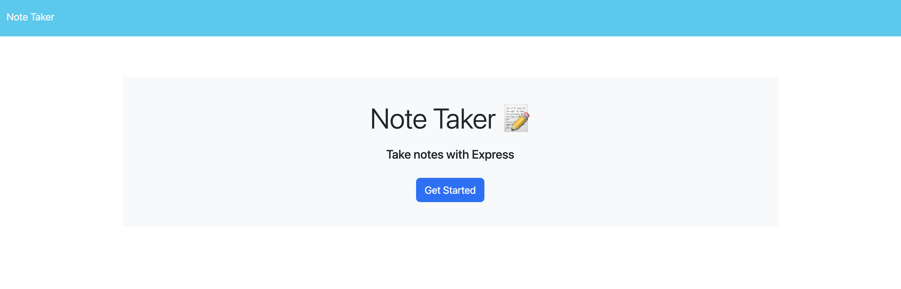
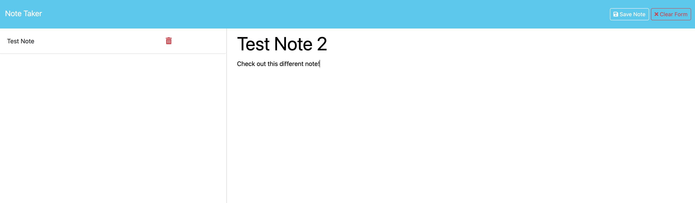

# hw-11-express-note-taker

  ## Description
  * Use the express package to build a server for a note taker app
  * Create a note with a title and a body which when saved is written to a db.json file and render to the saved notes column. 
  * Deleting notes is a breeze with id match
  * Here is a view of what the landing page will look like and when you click get started button the notes page loads.

  

  

  
  ## Table of Contents
  * [Installation](#installation)
  * [Usage](#usage)
  * [Contributing](#contribution)
  * [Questions](#questions)
  
  ## Installation

  To install necessary dependencies, run the following command:

  * npm i

  The page will be deployed live with Render but if you were to clone the repo after running npm you can start the server with either node server.js or npxnodemon server.js for continual updating of the server. 
  
  ## Usage
  * A Mac or PC with a terminal. Common examples are Zsh for Mac and Bash for Windows.
  * Once you navigate to the correct integrated terminal run the command node index.js to start the prompts. 

  ## Contributing
  * Create a pull request
  
  

  ## License
   

This project is unlicensed. 

  
  ## Questions
  * Here is a link to my [GitHub](https://github.com/soko77788) profile.
  * For further questions email me at nicksoko@gmail.com.

  ## Tools and 3rd party assistance
  * Influenced with the week 11 Express miniproject code along and Instructor demo in office hours starting in week 11. 
  * Render
  * Student AI tool and ChatGPT for some parts of the routes. post tasks, and delete tasks. Especially with understanding async await. 

  ## Obstacles and Successes
  * This was a very confusing week. I feel like the main classes were all over the place and jumping between .thens or async await created alot of issues.
  * Learning the Express package and using Insomnia AND deploying to Render. Even just restarting the server all the time was a hassle. Insomnia didn't like my file structure. 
  * The tip to think of server requests with JSON like local storage helps but is still a difficult concept and nailing the syntax is rough.
  * I didn't even try to include the router lesson in the homework because it didn't make alot of sense especially in a small app like this.  
  * How to know what middleware to use?? I don't get this part either.

  * Successes include just getting a server up and running isn't too hard. Hitting those servers was a different story. 
  * The app is up and running! It does what the challenge wants. 
  * The biggest aha moment was switching over to an async await style so you console wouldn't pop so many errors. 

  ## Render Link

https://hw-11-express-note-taker.onrender.com